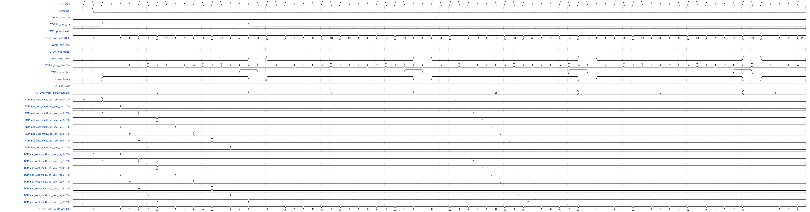
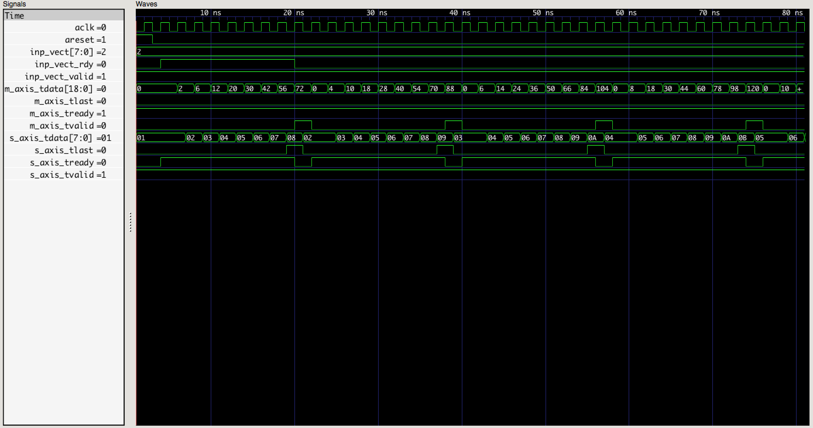

# ECE627 Lab2 Report
## Group Members: 
*Please Add Your Names Here* Zhuanhao Wu (zhuanhao.wu@uwaterloo.ca)

## Q1. RTL design
Assume that the multiplication is between an $N \times N$ matrix and an $N \times 1$ vector.

- Latency:
- Throughput:

## Q2. Waveforms

The waveform in Wavedrom is shown in {@fig:lab2-wavedrom}.

{#fig:lab2-wavedrom} 

The screenshot of VCD file is shown in {@fig:lab2-screenshot}

{#fig:lab2-screenshot}        

## Q3. Area-time tradeoffs

### Resource Utilization

The utilization is reported using `yosys` and the script for generating the report is `run_yosys.ys`.

```
=== mat_vect_mult2 ===

   Number of wires:                326
   Number of wire bits:            416
   Number of public wires:          19
   Number of public wire bits:      77
   Number of memories:               0
   Number of memory bits:            0
   Number of processes:              0
   Number of cells:                393
     FDCE                           38
     LUT2                           24
     LUT3                           26
     LUT4                            7
     LUT5                           10
     LUT6                          180
     MUXCY                          16
     MUXF7                          62
     MUXF8                          13
     XORCY                          17
```

By default, `yosys` does not use DSPs and instead use LUTs to implement the addition and multiplication logic.

### Trade-offs

The problem statement requires that the data is streamed into the design one at a time, and the vector is streamed into the design at the beginning.
Every element of the matrix will be used to calculate one multiplication and the result will be used in at most one addition. Thus, even if we can use multiple adders and multipliers, the data stream of matrix will limit the parallelism we can achieve and multiple adders/multipliers will not bring us any benefits.
